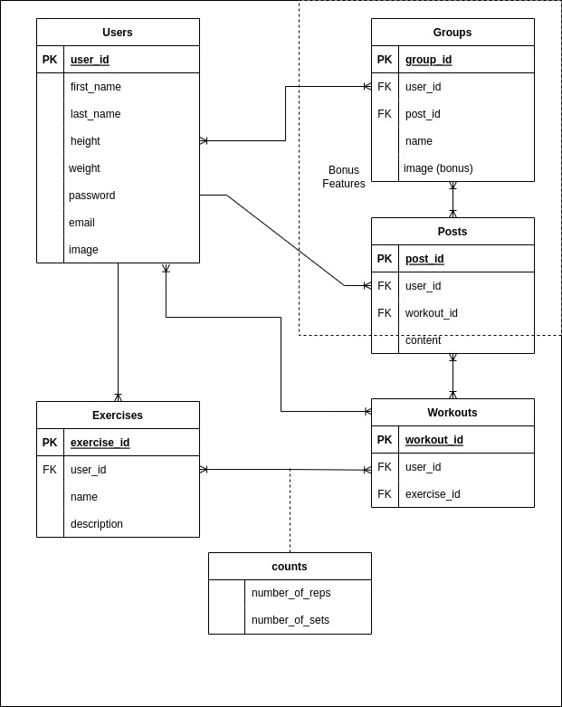
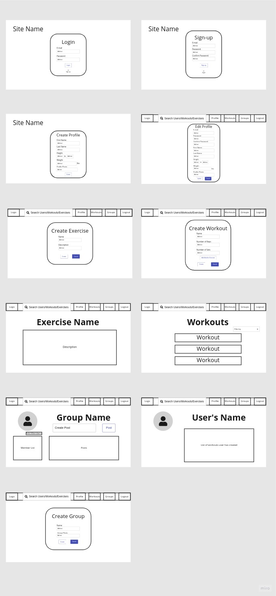

# workout-journal-project
A workout journal app that is designed with a Django back-end and a REACT front-end

[Link to the Front End](https://github.com/matthew-f-bell/workout-journal-front)

## User Stories
* As A User, I want to be able to login
* AAU, I want to be able to create an account
* AAU, I want to have a profile
* AAU, I want to edit my profile
* AAU, I want to create workouts
* AAU, I want to create exercises
* AAU, I want to have exercises in my workouts
* AAU, I want to be able to logout
* AAU, I want to be able to create workout groups
* AAU, I want to share my workouts

## ERD

## Wireframes
